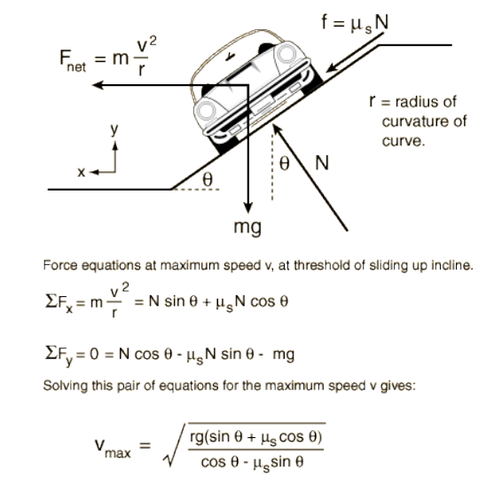

## Question 1    

The Diagram below shows the Force acting on a car as it moves around a banked roadway.
Assuming g is the gravitational constant 9.8 m/s2, 𝜃 𝑖𝑠 𝑖𝑛 𝑑𝑒𝑔𝑟𝑒𝑒𝑠, 𝜇𝑠 is the coefficient of 
friction between the road and tyre (no units), r is the radius of curve.  

  

Write a program in C to find the maximum speed 𝑉𝑚𝑎𝑥 of the car while driving on the 
incline.  

Execute your program with the following inputs :  
curve radius in km : 200  
angle of bank : 15  
friction coefficient : 0.5  

## Question 2  

This question deals with converting a number of millimeters to an equivalent number of
meters (m), decimeters (dm), centimeters (cm) and millimeters (mm). Your program
should read in a number of mm (integer). It should convert this input to its equivalent
number of m, dm, cm, and mm. For example, if the input is 3928, then the output should
be :  

3928 millimeters =  
3 meters  
9 decimeters  
2 centimeters  
8 millimeters  

Please use the above format for your output. Execute your program with an input of 3928
millimeters.
